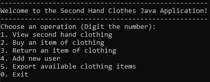
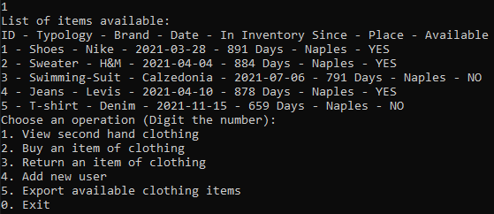
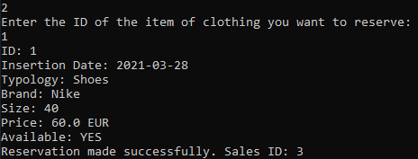

<meta name="title" content="Clothes Database App">
<meta name="description" content="A Database made in Java that allows users to perform various operations related to the available clothing items, users, and sales">
<meta name="keyword" content="Clothes Database App, ClothesDatabase, Java Database, Clothes Database App Github, Github, R3ddy95, R3ddy95 Github, Java">

# Clothes Database App 👚​ 
Clothes Database App is designed to manage a second-hand clothing database. <br>
It allows users to perform various operations related to the available clothing items, users, and sales. <br> 
It provides a command-line interface for users to interact with the database. When you run the program, it displays a menu with different options.

## How it works
The application starts by presenting a menu to the user.



For example, if the user selects option 1, the program displays a list of available clothing items.



If the user selects option 2, the program guides them through the process of purchasing an item and updates the data accordingly.



## Languages
* Java

## What i used
* [Java](https://dev.java/)
* [JDK 20](https://www.oracle.com/it/java/technologies/downloads/) i opted for the Java Development Kit 20

## Installation
First of all, you need JDK installed.
If you don't have it, you can download it here:
[JDK 20](https://www.oracle.com/it/java/technologies/downloads/)<br>
And be sure to set the Java Path currectly, if you want you can follow this easy tutorial:
[How to set java classpath in windows 10/11](https://www.youtube.com/watch?v=ftyEsnxVLY4) <br>

### 1 - Clone the repository
```bash

git clone https://github.com/R3ddy95/ClothesDatabaseApp.git

```

### 2 - Compile the class files
Open the directory folder where you cloned the repo, and digit this in the command line (You can use Visual Studio Code, Eclipe or the CMD):

```bash

javac MainApp.java

```

### 3 - Create the JAR file
After compiling the files, run this command to create the JAR file:

```bash

jar cfm ClothesDatabaseApp.jar manifest.txt MainApp.class controller/*.class model/*.class server/*.class

```

### 4 - Run it!
```bash

java -jar ClothesDatabaseApp.jar

```

##  License
[MIT](https://choosealicense.com/licenses/mit/)

## Contact Me
My Email: edoardo.vitagliano3@gmail.com <br>
You can find my Linkedin profile here: https://www.linkedin.com/in/edoardo-vitagliano-299737110/